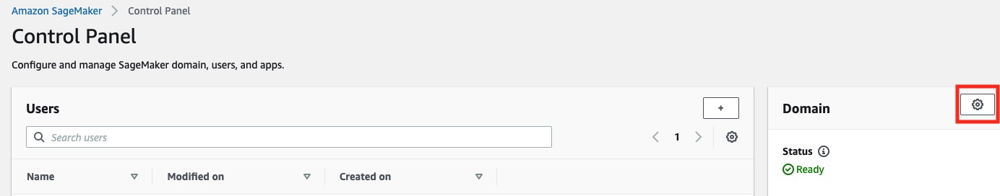
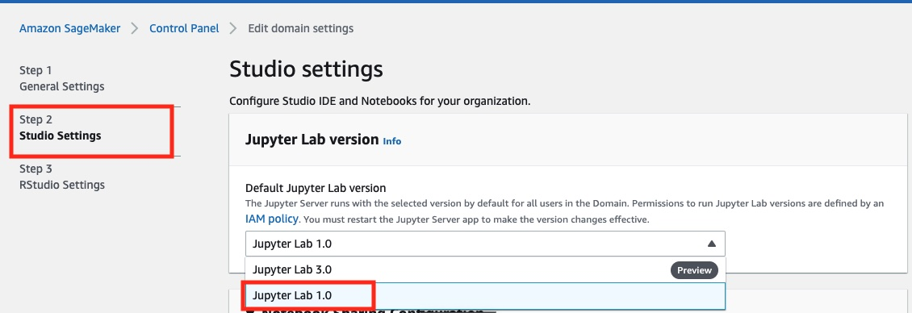

# Frequently Asked Questions

- [How many people can join one team?](#how-many-people-can-join-one-team)
- [Can one person be in different teams?](#can-one-person-be-in-different-teams)
- [How to create a team?](#how-to-create-a-team)
- [How to change a team?](#how-to-change-a-team)
- [Can I change my team name?](#can-i-change-my-team-name)
- [How to reset the password?](#how-to-reset-the-password)
- [When I reset my password, do I also change the password for the whole team?](#when-i-reset-my-password-do-i-also-change-the-password-for-the-whole-team)
- [How to join an existing team?](#how-to-join-an-existing-team)
- [How to find new team members?](#how-to-find-new-team-members)
- [If I already registered a team, do the other team members also have to register?](#if-i-already-registered-a-team-do-the-other-team-members-also-have-to-register)
- [Can working students also join the challenge?](#can-working-students-also-join-the-challenge)
- [Why is it "up to value" of certain amount of Euro?](#why-is-it-up-to-value-of-certain-amount-of-euro)
- [Where do I find the videos for the Tutorials?](#where-do-i-find-the-videos-for-the-tutorials)
- [How can I access my AWS account?](#how-can-i-access-my-aws-account)
- [The Sagemaker studio error states: Failed to change instance; what should I do?](#the-sagemaker-studio-error-states-failed-to-change-instance-what-should-i-do)
- [When opening a Tutorial, the Sagemaker studio seems to be stuck in the state "Starting notebook kernel"](#when-opening-a-tutorial-the-sagemaker-studio-seems-to-be-stuck-in-the-state-starting-notebook-kernel)
- [AWS CLI doesn't work in sagemaker studio notebooks](#aws-cli-doesnt-work-in-sagemaker-studio-notebooks)
- [How to change the jupyter lab version used in the Sagemaker Studio Domain?](#how-to-change-the-jupyter-lab-version-used-in-the-sagemaker-studio-domain)
- [An error appeared when running on-jupyter-server-start.sh. "jupyter: command not found"](#an-error-appeared-when-running-on-jupyter-server-startsh-jupyter-command-not-found)
- [Is this an image classification task or is there more to extract?](#is-this-an-image-classification-task-or-is-there-more-to-extract)
- [Is every bounding box a separate worm?](#is-every-bounding-box-a-separate-worm)
- [What is the maximum score a team can receive?](#what-is-the-maximum-score-a-team-can-receive)
- [How long does it take to get the AWS links or registration confirmation after the team registration has been done?](#how-long-does-it-take-to-get-the-aws-links-or-registration-confirmation-after-the-team-registration-has-been-done)
- [Can we have the kickoff session PowerPoint?](#can-we-have-the-kickoff-session-powerpoint)
- [When do we receive access to the dataset? ](#when-do-we-receive-access-to-the-dataset)
- [What is the weekly budget for AWS? ](#what-is-the-weekly-budget-for-aws)
- [Is it mandatory to have a team size of four people?](#is-it-mandatory-to-have-a-team-size-of-four-people)
- [Can we use any component of AWS once we get access to the environment?](#can-we-use-any-component-of-aws-once-we-get-access-to-the-environment)
- [Can you highlight the evaluation process or the selection process of the competition?](#can-you-highlight-the-evaluation-process-or-the-selection-process-of-the-competition)
- [How many times can we re-submit our improved solution?](#how-many-times-can-we-re-submit-our-improved-solution)
- [The AWS will be provided with GPU instances for training, correct?](#the-aws-will-be-provided-with-gpu-instances-for-training-correct)
- [How do I register?](#how-do-i-register)
- [Are there expert label samples of the worms?](#are-there-expert-label-samples-of-the-worms)
- [Are all these images already scaled to the same size?](#are-all-these-images-already-scaled-to-the-same-size)
- [Do we send a model or just detection box with coordinates?](#do-we-send-a-model-or-just-detection-box-with-coordinates)
- [Who should we contact if we have login issues?](#who-should-we-contact-if-we-have-login-issues)
- [Is the unlabeled data available or only is it on the expert side?](#is-the-unlabeled-data-available-or-only-is-it-on-the-expert-side)
- [If some of us do not find a team, will there be help to join other teams?](#if-some-of-us-do-not-find-a-team-will-there-be-help-to-join-other-teams)
- [How to join the GDSC MS Teams?](#how-to-join-the-gdsc-ms-teams)
- [What can you do if you were not able to confirm your account?](#what-can-you-do-if-you-were-not-able-to-confirm-your-account)
- [How to check AWS service expenses?](#how-to-check-aws-service-expenses)
- [What is the best input resolution?](#what-is-the-best-input-resolution)
- [I tried to load a checkpoint and continue training from there, the accuracy went to 100 percent and loss to nan.](#i-tried-to-load-a-checkpoint-and-continue-training-from-there-the-accuracy-went-to-100-percent-and-loss-to-nan)
- [I tried to run the model with a higher resolution and got an out of memory error.](#i-tried-to-run-the-model-with-a-higher-resolution-and-got-an-out-of-memory-error)
- [I am struggling to use data from different input channels, see also the teams post.](#i-am-struggling-to-use-data-from-different-input-channels-see-also-the-teams-post)
- [I tried many different models but am not seeing much progress, should I move to a different library?](#i-tried-many-different-models-but-am-not-seeing-much-progress-should-i-move-to-a-different-library)
- [How do you best collaborate with Sagemaker?](#how-do-you-best-collaborate-with-sagemaker)
- [When will the new quota be updated for this week?](#when-will-the-new-quota-be-updated-for-this-week)
- [A masking is basically creating a contour of the worm regions in binary images, are masking techniques a good approach for detecting worms?](#a-masking-is-basically-creating-a-contour-of-the-worm-regions-in-binary-images-are-masking-techniques-a-good-approach-for-detecting-worms)
- [What is meant by aggregating information from worm sections within the similar areas of interest of different stainings that look alike?](#what-is-meant-by-aggregating-information-from-worm-sections-within-the-similar-areas-of-interest-of-different-stainings-that-look-alike)
- [Some labelings are not correctly done, are there issues with labeling?](#some-labelings-are-not-correctly-done-are-there-issues-with-labeling)
- [The smaller worms are sometimes not recognized by the model. Is there a way to improve that?](#the-smaller-worms-are-sometimes-not-recognized-by-the-model-is-there-a-way-to-improve-that)
- [Any info regarding AWS certificates?](#any-info-regarding-aws-certificates)
- [Will some optional features such as adding new team member be implemented?](#will-some-optional-features-such-as-adding-new-team-member-be-implemented)

## How many people can join one team?

- The max. size of a team is 4 people. 

## Can one person be in different teams?

- No, a participant can only be part of a single team at a time and that team must have the participants Capgemini or Sogeti email address. The website will not allow the same participant i.e. email address to be added to another team simultaneously.

## How to create a team?

- Go to https://gdsc.ce.capgemini.com/
- Press the *Login / Sign Up* button in the top right
- Press *Sign Up*
- Fill out the Sign Up form. It includes the team name and all team members.

## How to change a team?

- Once a team is registered, the team members cannot be changed anymore.

## Can I change my team name?

- No.

## How to reset the password?
- Click the "Password Reset" button at the [signup page](https://gdsc.ce.capgemini.com/password_reset/)
- Forgot Password page would be rendered. 
- You will receive the link to reset the password. 
- Once the password is changed, you can log in using the new password.

## When I reset my password, do I also change the password for the whole team?

- No. When we sign up a team, we have the same password for the whole team members, but if a team member change his/her password, he/she only changes his/her user login password.

## How to join an existing team?

- No team member can be added or removed after a team is registered.

## How to find new team members?

- Check and leave a message on [MS Teams](https://teams.microsoft.com/l/channel/19%3aa32e03d38fc940ee9d4b20a7cc9e030d%40thread.skype/Looking%2520for%2520Team?groupId=7d77d672-dff1-4c9f-ac55-3c837c1bebf9&tenantId=76a2ae5a-9f00-4f6b-95ed-5d33d77c4d61)

## If I already registered a team, do the other team members also have to register?

- No, if you add other members to your team, then they do not need to register again.

## Can working students also join the challenge?

- Yes.

## Why is it "up to value" of certain amount of Euro?

- Based on the conversion rate/exchange rate, it might not be the full cash prize in Euro.

## Where do I find the videos for the Tutorials?

- You can find the videos on our Capgemini Stream. The link will be shared after the kick-off call.

## How can I access my AWS account? 

- After your teams registration, you should have received an confirmation e-mail. The e-mail looks like this 

- After your confirmation, you will receive an e-mail from AWS (no-reply@login.awsapps.com) with the subject: 'Invitation to join AWS Single Sign-On'. This e-mail looks like this:

- Click on the button 'Accept Invitation' and enter your username from the invitation e-mail. You will be prompted to set a new password. 
- You can now login using the link in the invitation e-mail under 'User portal URL'. The portal looks like this:

- You will see your AWS Account after you logged in. Now you can click on 'Management Console' to access it.  
- If you access your team's account for the first time, make sure to go through [Tutorial 1](https://github.com/gdsc5/Tutorial1_Setting_up_AWS) or watch the corresponding [video](https://web.microsoftstream.com/video/ce2af85f-e8b3-4445-ba43-2331baddb64a).
- 
## The Sagemaker studio error states: Failed to change instance; what should I do?

Error message:

- What a few minutes. The instance is currently starting or stopping. After around 5-10 min, you should be able to either use it or start it again. 
- Please check the resources tab in the left pane of Sagemaker Studio for more information of your current instances.
- If you see the instance there, please make sure to select the kernel image first and afterwards the instance, if necessary.  

## When opening a Tutorial, the Sagemaker studio seems to be stuck in the state "Starting notebook kernel"

- The image that we use is very big, it therefore can take some time to load. If it wasn't loaded after 10 minute, try to refresh your browser. 
- If it still loads, try to shut down all running apps / instances (Shown in [Tutorial 1](https://github.com/gdsc5/Tutorial1_Setting_up_AWS)) and start the notebook again.

## AWS CLI doesn't work in sagemaker studio notebooks

- Reason: The image that we are using for the challenge doesn't support the AWS command line interface (cli) due to incompatible licenses in required packages.
- Workaround: Open an <b> system </b> terminal via the launcher (see Tutorial 4 for reference). You can use the aws cli here. The filesystem is shared between all terminals / instances.

## How to change the jupyter lab version used in the Sagemaker Studio Domain?

- During the challenge we will only be using Jupyter Lab 1.0. 
- If you have chosen another version, you can switch the version in the AWS management console.
- Follow these steps:
    - Open the Sagemaker Studio View from the control panel
    - Click on the gear next to the word 'Domain' in the right pane
    
    - You are now in Edit Domain Settings. You can navigate to Step 2: Studio Settings. Here you should choose version 1: 
    .
    - Please select the correct version (Jupyter Lab 1.0) from the drop down. 
    - Now you can finish the setup and click on next and then submit. The changes may take a few moments to apply.

## An error appeared when running on-jupyter-server-start.sh. "jupyter: command not found"

- This can error can have 2 origins:
1. You  didn't run the script in a system terminal but in an image terminal. If that's the case, please choose a <b>system</b> terminal from the launcher as described in Tutorial 1.
2. You have chosen Jupyter Lab 3.0 (Preview) from the available versions when creating your Sagemaker Studio. Please refer to [this](#how-to-change-the-jupyter-lab-version-used-in-the-sagemaker-studio-domain) Question for how to change back to Version 1.0.

## Is this an image classification task or is there more to extract?

- For #GDSC5, we simplified it to an object detection task. 

## Is every bounding box a separate worm?

- No, multiple bounding boxes can show the same worm. Typically, there are 2-3 worms in one image. Worms are twisted and coiled when they are in a nodule. So, when you take a slice out of a nodule, you typically cut the same worm multiple times. Hence, multiple worm sections belong to the same worm. Figuring out which sections belong to the same worm is a challenge even for experts.

## What is the maximum score a team can receive?

- The maximum possible score is 300. The maximum score for the detection accuracy for any threshold is 100. Since we sum up the detection accuracy for three different thresholds, the maximum score comes to 300. Realistically, we expect this is not reachable since we are dealing with expert-labeled data, which usually isn’t perfect.

## How long does it take to get the AWS links or registration confirmation after the team registration has been done? 

- The registration confirmation is immediate. The AWS accounts will be open, starting the week of June 13th. 

## Can we have the kickoff session PowerPoint?

- The PowerPoint presentation is available on Teams. You can find it on the [resources page](https://gdsc.ce.capgemini.com/app/portal/resources).

## When do we receive access to the dataset? 

- You will only be able to access to data from your AWS account. You are not permitted to download it to ensure we’re reducing our carbon footprint. The access will be shown in the AWS tutorials provided.

## What is the weekly budget for AWS? 

- The budget will by dynamic, depending on the number and activity of the teams. We start with $50 US dollars.

## Is it mandatory to have a team size of four people? 

- No. The team size can be anywhere from 1 to 4 people. Four team members is encouraged, but if you check the [hall of fame](https://gdsc.ce.capgemini.com/app/gdscHistory), you’ll find the teams with fewer people are also often very successful.

## Can we use any component of AWS once we get access to the environment? 

- Not quite. You have access to everything you’ll need to build a successful solution. Services that are not required are disabled.

## Can you highlight the evaluation process or the selection process of the competition?

- Your submissions are scored using the formula explained in [slides 12-14](https://capgemini.sharepoint.com/:p:/r/sites/GlobalDataScienceChallenge806/Shared%20Documents/General/GDSC%202022%20-%20Code%20For%20Cure/GDSC5_KickOff_June9_final.pptx?d=w4caf5b5093a94307bdb003e34738e738&csf=1&web=1) in the kick-off deck.

## How many times can we re-submit our improved solution?

- You can re-submit your improved solution as often as you want. However, if we detect a team is spamming the submission page, we will block the team from doing that. For reference, in the GDSC 2020, there was one team with over 1,000 submissions.

## The AWS will be provided with GPU instances for training, correct? 

- Yes, each team will have one Graphics Processing Unit (GPU) instance at their disposal.

## How do I register?

- You can register [here](https://gdsc.ce.capgemini.com/app/login). However, ahead of registering, you must first form or join a team via our [GDSC Teams channel](https://capgemininar-my.sharepoint.com/personal/sharmelle_brooks_capgemini_com/Documents/A.%09https:/teams.microsoft.com/l/team/19%3a4017a2e9af4942e7aa157d6ec9d751b4%40thread.skype/conversations?groupId=7d77d672-dff1-4c9f-ac55-3c837c1bebf9&tenantId=76a2ae5a-9f00-4f6b-95ed-5d33d77c4d61).

## Are there expert label samples of the worms?

- On slide 12 of the #GDSC5 kick-off deck, you’ll find the labels done by an expert.

## Are all these images already scaled to the same size? 

- No, they have different sizes and shapes. 

## Do we send a model or just detection box with coordinates? 

- The submission will be in the form of csv files with bounding boxes coordinates. This will be shown in the tutorials. Only the teams selected for the panel presentation will have to submit their source code and models for reviews by the organization team.

## Who should we contact if we have login issues? 

- Please write your login related concerns to the [GDSC Teams channel](https://capgemininar-my.sharepoint.com/personal/sharmelle_brooks_capgemini_com/Documents/A.%09https:/teams.microsoft.com/l/team/19%3a4017a2e9af4942e7aa157d6ec9d751b4%40thread.skype/conversations?groupId=7d77d672-dff1-4c9f-ac55-3c837c1bebf9&tenantId=76a2ae5a-9f00-4f6b-95ed-5d33d77c4d61). We appreciate your patience if you haven't received the confirmation email yet.

## Is the unlabeled data available or only is it on the expert side?

- The 73 images used for the test and validation leaderboard come without labels.

## If some of us do not find a team, will there be help to join other teams?

- You can find a team to join on the [GDSC Teams channel](https://capgemininar-my.sharepoint.com/personal/sharmelle_brooks_capgemini_com/Documents/A.%09https:/teams.microsoft.com/l/team/19%3a4017a2e9af4942e7aa157d6ec9d751b4%40thread.skype/conversations?groupId=7d77d672-dff1-4c9f-ac55-3c837c1bebf9&tenantId=76a2ae5a-9f00-4f6b-95ed-5d33d77c4d61).

## How to join the GDSC MS Teams?

- You can contact us via [email](mailto:nien-chun.yin@capgemini.com) and we will add you to the channel.

## What can you do if you were not able to confirm your account?

- Please check this [link](https://gdsc.ce.capgemini.com/app/resend)

## How to check AWS service expenses?

- On AWS Console, go to 'Billing' and click "Cost Explorer" on the left. You can see your cost summary after choosing "Launch Cost Explorer".

## what is the best input resolution?

- I don't know. The default resolutions (1333x800) is likely too low.
	
## I tried to load a checkpoint and continue training from there. The accuracy went to 100 percent and loss to nan.

- Something went seriously wrong. Try to initialize from the weights instead of using the checkpoint functionality. Also post in the Data and AI Questions channel. Maybe some other team was able to solve this.
	
## I tried to run the model with a higher resolution and got an out of memory error.

- The g4dn instances have 16GB GPU-RAM. That should be sufficient for at least 2kx2k. Check that you reduced the number of workers in the config and the batch size. Also post in the Data and AI Questions channel. Maybe some other team can help you out.

## I am struggling to use data from different input channels, see also the teams post.

- This seems like a pathing issue. Verify that the data actually gets downloaded and that you're looking in the right place
 
## I tried many different models but am not seeing much progress. Should I move to a different library

- Only switch if you are confident that the other tool offers some real improvement. I'd rather focus on data quality. See also https://www.deeplearning.ai/wp-content/uploads/2021/06/MLOps-From-Model-centric-to-Data-centric-AI.pdf
 
## How do you best collaborate with Sagemaker

- Use some planning tool like trello or the teams planer to structure tasks. As long as you are in the ideation phase, use a different notebook for each team member. If you need branches, do one check out per team member. Then everybody works on their own director

## When will the new quota be updated for this week?

- Every Tuesday we will release the new quota in aws, time of day varies. 

## A masking is basically creating a contour of the worm regions in binary images, are masking techniques a good approach for detecting worms?

- Maybe. Try it out. 

## What is meant by aggregating information from worm sections (within the similar areas of interest) of different stainings that look alike? 

- Images from different stainings show the same worm. So if you see a worm section at the very top of the image in one staining, there is a high chance that there will also be one at the very top of another staining. 

## Some labelings are not correctly done, are there issues with labeling?

- Human labels are always error prone. If you find something systematic I encourage you to discuss it in teams. 

## The smaller worms are sometimes not recognized by the model. Is there a way to improve that? 

- Increase the resolution. With the tutorial approach, a small worm will be reduced to a few pixels and not distinguishable from the background. 

## Any info regarding AWS certificates? 

- ML: see [post](https://teams.microsoft.com/l/message/19:97d8b47c7c8444aa9a21fdeaebd6a79b@thread.skype/1656061646276?tenantId=76a2ae5a-9f00-4f6b-95ed-5d33d77c4d61&groupId=7d77d672-dff1-4c9f-ac55-3c837c1bebf9&parentMessageId=1656061646276&teamName=Global%20Data%20Science%20Challenge%20-%20Public&channelName=Announcements&createdTime=1656061646276) ; Cloud Practitioner: we will keep you updated 

## Will some optional features such as adding new team member be implemented? 

- It's on the todo list, but not at the top. The more people ask for this feature, the sooner we'll get to it 
