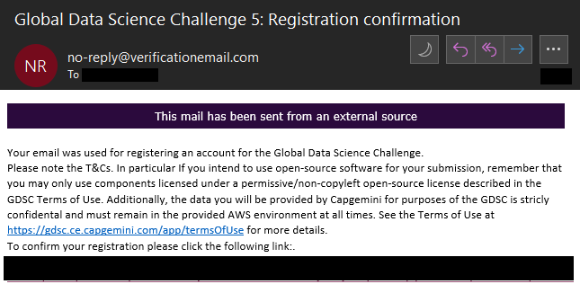
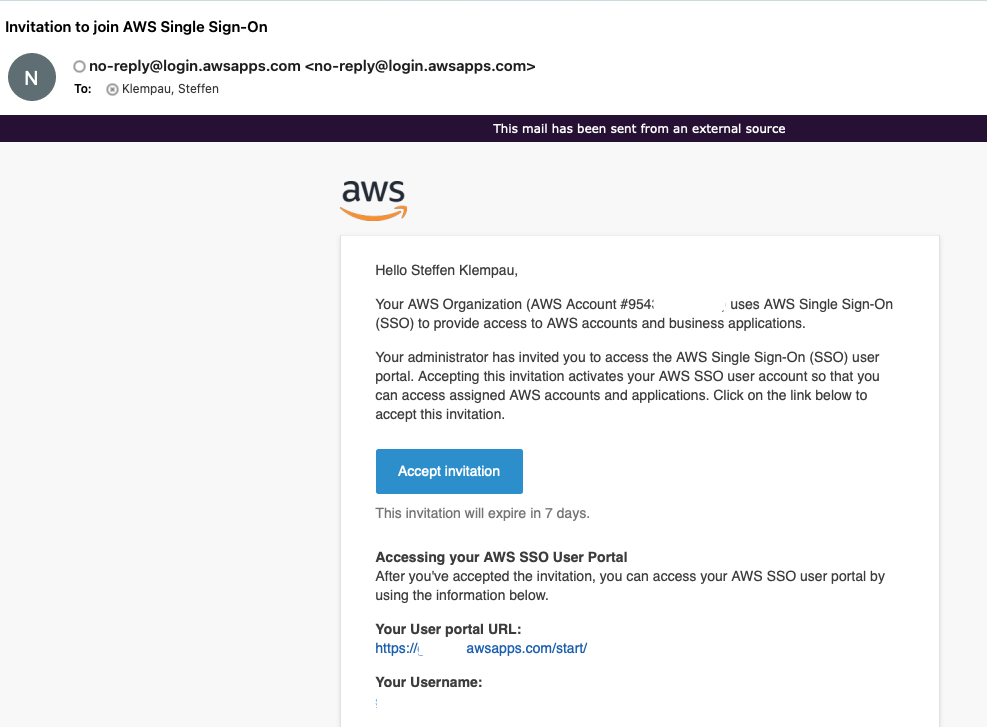
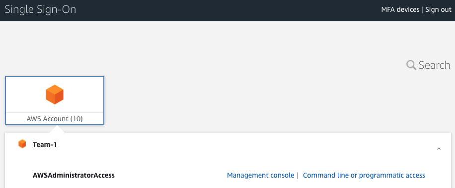
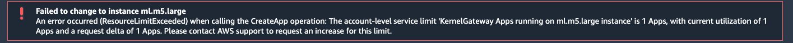

# Frequently Asked Questions

- [How many people can join one team?](#how-many-people-can-join-one-team)
- [Can one person be in different teams?](#can-one-person-be-in-different-teams)
- [How to create a team?](#how-to-create-a-team)
- [How to change a team?](#how-to-change-a-team)
- [Can I change my team name?](#can-ichange-my-team-name)
- [How to reset the password?](#how-to-reset-the-password)
- [When I reset my password, do I also change the password for the whole team?](#when-i-reset-my-password-do-i-also-change-the-password-for-the-whole-team)
- [How to join an existing team?](#how-to-join-an-existing-team)
- [How to find new team members?](#how-to-find-new-team-members)
- [If I already registered a team, do the other team members also have to register?](#if-i-already-registered-a-team-do-the-other-team-members-also-have-to-register)
- [Can working students also join the challenge?](#can-working-students-also-join-the-challenge)
- [Why is it "up to value" of certain amount of Euro?](#why-is-it-up-to-value-of-certain-amount-of-euro)
- [Where do I find the videos for the Tutorials?](#where-do-i-find-the-videos-for-the-tutorials)
- [How can I access my AWS account?](#how-can-i-access-my-aws-account)
- [The Sagemaker studio error states: Failed to change instance; what should I do?](#the-sagemaker-studio-error-states-failed-to-change-instance-what-should-i-do)

## How many people can join one team?

- The max. size of a team is 4 people. 

## Can one person be in different teams?

- No, a participant can only be part of a single team at a time and that team must have the participants Capgemini or Sogeti email address. The website will not allow the same participant i.e. email address to be added to another team simultaneously.

## How to create a team?

- Go to https://gdsc.ce.capgemini.com/
- Press the *Login / Sign Up* button in the top right
- Press *Sign Up*
- Fill out the Sign Up form. It includes the team name and all team members.

## How to change a team?

- Once a team is registered, the team members cannot be changed anymore.

## Can I change my team name?

- No.

## How to reset the password?
- Click the "Password Reset" button at the [signup page](https://gdsc.ce.capgemini.com/password_reset/)
- Forgot Password page would be rendered. 
- You will receive the link to reset the password. 
- Once the password is changed, you can log in using the new password.

## When I reset my password, do I also change the password for the whole team?

- NO. When we sign up a team, we have the same password for the whole team members, but if a team member change his/her password, he/she only changes his/her user login password.

## How to join an existing team?

- No team member can be added or removed after a team is registered.

## How to find new team members?

- Check and leave a message on [MS Teams](https://teams.microsoft.com/l/channel/19%3aa32e03d38fc940ee9d4b20a7cc9e030d%40thread.skype/Looking%2520for%2520Team?groupId=7d77d672-dff1-4c9f-ac55-3c837c1bebf9&tenantId=76a2ae5a-9f00-4f6b-95ed-5d33d77c4d61)

## If I already registered a team, do the other team members also have to register?

- No, if you add other members to your team, then they do not need to register again.

## Can working students also join the challenge?

- Yes.

## Why is it "up to value" of certain amount of Euro?

- Based on the conversion rate/exchange rate, it might not be the full cash prize in Euro.

## Where do I find the videos for the Tutorials?

- You can find the videos on our Capgemini Stream. Link will be shared after the kick-off call.

## How can I access my AWS account? 

- After your teams registration, you should have received an confirmation e-mail. The e-mail looks like this 

- After your confirmation, you will receive an e-mail from AWS (no-reply@login.awsapps.com) with the subject: 'Invitation to join AWS Single Sign-On'. This e-mail looks like this:

- Click on the button 'Accept Invitation' and enter your username from the invitation e-mail. You will be prompted to set a new password. 
- You can now login using the link in the invitation e-mail under 'User portal URL'. The portal looks like this:

- You will see your AWS Account after you logged in. Now you can click on 'Management Console' to access it.  

## The Sagemaker studio error states: Failed to change instance; what should I do?

Error message:

- What a few minutes. The instance is currently starting or stopping. After around 5-10 min, you should be able to either use it or start it again. 
- Please check the resources tab in the left pane of Sagemaker Studio for more information of your current instances.
- If you see the instance there, please make sure to select the kernel image first and afterwards the instance, if necessary.  
