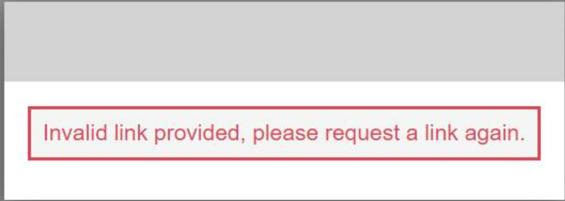

## Tutorial 0 : Step by step process for setting up your account for #GDSC6 challenge

Here are the steps that you would need to follow to set up your account for the Challenge :

Singing Up and Logging to the Website:
 
1. Navigate to the GDSC Portal's Sign-up page - https://gdsc.ce.capgemini.com/app/signup/. Enter all the required details and password in the given format. Please be sure to read and accept the applicable T&Cs. 
2. Once you Sign-up, you will receive an e-mail like the one shown below from gdsc.ce@capgemini.com.  
3. Please click on the Verfication link provided in the e-mail. You will receive an error such as this. But do not worry, you can now login to the website using your e-mail ID and password. 
4. To login to the Website, navigate to the login page - https://gdsc.ce.capgemini.com/app/login/ and enter your credentials. 
5. Once you login you will have access to the Resources - https://gdsc.ce.capgemini.com/app/portal/resources/. The page has link to all the information and Tutorials that you will be needing for the challenge. 

Forming/joining a Team: 
 
1. You may also join the Teams channel (https://teams.microsoft.com/l/team/19%3a4017a2e9af4942e7aa157d6ec9d751b4%40thread.skype/conversations?groupId=7d77d672-dff1-4c9f-ac55-3c837c1bebf9&tenantId=76a2ae5a-9f00-4f6b-95ed-5d33d77c4d61) for active dicussion on all Topics related to the channel. There is a channel for team formation ('Looking for Team') where you can find other members for you to team up with.
2. Every participant needs to register individually and then form a Team with other participants. To form a Team navigate to - https://gdsc.ce.capgemini.com/app/portal/.    
3. You can either create a new team or join an existing team. Once you create a new team, you  will receive the Team ID which you can share with other participants who can then join your team.
4. Existing members of the team can approve/decline requests from new members.

Setting up your AWS accounts: 
 
1. Once you are part of a team, you can login to your AWS accounts using the below credentials:
2.    URL       : https://gdsc22.awsapps.com/start#/
      User Name : Use your full name as it is displayed in our portal on https://gdsc.ce.capgemini.com/app/portal/ in the 'My Team Page' and replace whitespace with underscores ("_"). Please mind upper- and lowercase in the name.
3. Once you do this, you'll receive an email from AWS with the verification code and then you can set your password.
4. Once your password is set, you can log in to your account afterwards. 
5. Once you are logged in click on 'AWS Account' and then to the AWS account created for your Team.
6. For future logins, you can directly click on  https://gdsc22.awsapps.com/start#/ 
